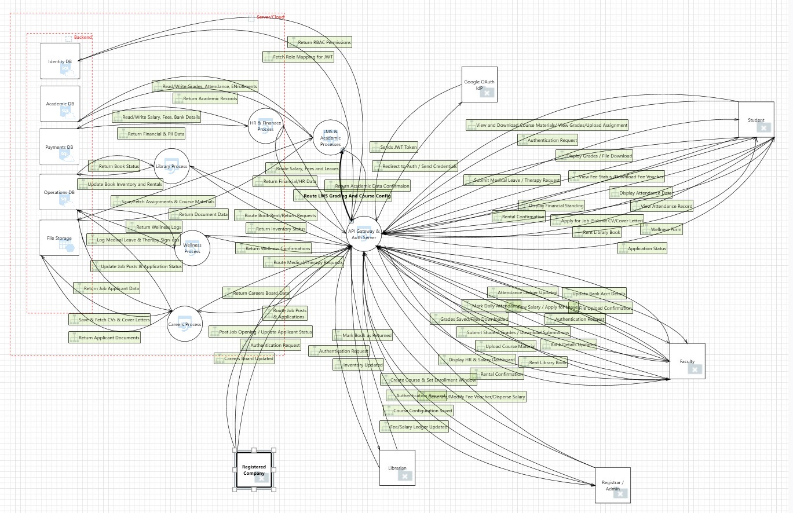
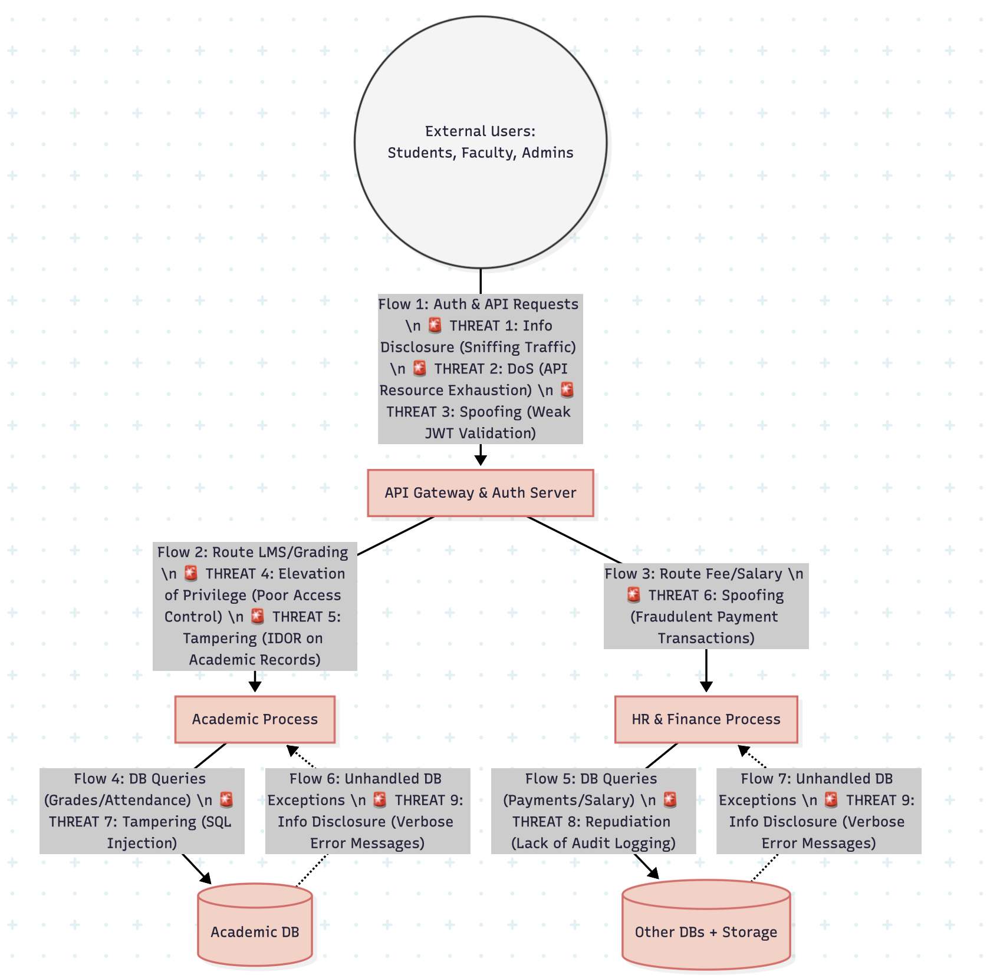

# Secure Architecture and Design Report
**Project Scenario:** University Management System

**Prepared by:** Meesum Abbas  

---

## Executive Summary
This report documents the threat modeling and secure architecture design for a University Management System. Utilizing the Microsoft Threat Modeling Tool (MTMT) and the STRIDE methodology, critical assets were identified, potential threats were analyzed, and a defense-in-depth architecture was designed. The system employs a modular, service-oriented architecture featuring an API Gateway, dedicated business processes (Academic, HR/Finance, Operations), and segregated databases to strictly isolate sensitive financial and health records. The final implementation fortifies this baseline with Role-Based Access Control (RBAC), cryptographic validation, and strategic risk transfer mechanisms.

---

## 1. System Definition and Initial Architecture

The University Management System is designed with a service-oriented architecture to securely route and process distinct operational domains.

**Initial Core Components & Trust Boundaries:**
* **External Entities:** Students, Faculty, Administrators, Librarians, and Corporate Partners.
* **API Gateway & Auth Server:** The central entry point handling JWT validation and routing external requests to the appropriate internal processes.
* **Backend Processes:** Isolated application logic handlers including the Academic Process (LMS/Grades), HR & Finance Process (Fees/Salary), and Operations Process (Library/Careers/Wellness).
* **Data Stores:** Segregated databases based on data sensitivity, including the Identity DB, Academic DB, Operations DB, and the highly restricted Payments DB.
* **Trust Boundaries:** An Internet Boundary separating public users from the API Gateway, and an Internal Network/DMZ Boundary separating the Gateway from the backend processes and databases.

---

## 2. Asset Identification and Security Objectives

### 2.1 Asset Inventory Table

| Asset ID | Category | Asset Name | Description | Storage / Location |
| :--- | :--- | :--- | :--- | :--- |
| **A-01** | Credentials | Authentication Tokens | JWTs and Google OAuth mapping tokens used to verify user sessions. | Identity DB / Client Browser |
| **A-02** | Credentials | Access Control Rules | Role-Based Access Control (RBAC) definitions mapping users to specific system permissions. | Identity DB |
| **A-03** | Personal Data | User PII & Profiles | Student/Faculty names, contact details, CVs, and cover letters. | Operations DB / File Storage |
| **A-04** | Personal Data | Protected Health Information (PHI) | Highly sensitive medical leave applications and mental health therapy requests. | Operations DB |
| **A-05** | Personal Data | Academic Records | Student grades, calculated GPAs, transcripts, and daily attendance logs. | Academic DB |
| **A-06** | Financial Data | Faculty Salary & Bank Details | Faculty salary dispersal logs and linked bank account information. | Payments DB |
| **A-07** | Financial Data | Student Fee Records | Fee voucher generation records, payment statuses, and transaction logs. | Payments DB |
| **A-08** | Business Logic | Academic Rules Engine | Code executing GPA calculations, prerequisite checks, and enrollment window validations. | Academic Process Server |
| **A-09** | Business Logic | Auth & Routing Logic | The API Gateway configurations dictating traffic flow and authorization enforcement. | API Gateway Server |

### 2.2 Mapping of Assets to Security Objectives

| Asset ID | Asset Name | Confidentiality | Integrity | Availability | Accountability |
| :--- | :--- | :--- | :--- | :--- | :--- |
| **A-01** | Authentication Tokens | High: Tokens must be encrypted in transit to prevent session hijacking. | High: Tokens must be cryptographically signed to prevent tampering or forgery. | Medium: Authentication services must be responsive to allow user logins. | High: Every token issuance must be logged to track which IP/user authenticated. |
| **A-02** | Access Control Rules | Medium: Rules should not be publicly exposed to prevent system mapping. | High: Unauthorized modification would lead to immediate privilege escalation. | High: Must be continuously available for the API Gateway to authorize requests. | High: Any changes to RBAC roles by an Admin must be strictly audited. |
| **A-03** | User PII & Profiles | High: Must be restricted to authorized users (e.g., specific companies for CVs). | Medium: Data must remain accurate as submitted by the user. | Medium: Needed for daily operations (library, careers portal). | Medium: System must log who accessed or downloaded user CVs/Profiles. |
| **A-04** | Protected Health Information | Critical: Strict isolation; visible only to the specific user and authorized wellness staff. | High: Medical records must not be altered maliciously. | Medium: Must be accessible when users need to submit or review requests. | Critical: Every access, view, or modification of PHI must generate an immutable audit log. |
| **A-05** | Academic Records | High: Students can only view their own grades; faculty can only view their assigned courses. | Critical: Grades, transcripts, and attendance must be completely tamper-proof. | High: High demand during peak times (grade publication, enrollment). | High: Modifications (e.g., faculty publishing a grade) must be tied to a specific faculty ID. |
| **A-06** | Faculty Salary & Bank Details | Critical: Visible only to the specific faculty member and authorized HR Admins. | Critical: Altering bank details or salary amounts would result in direct financial theft. | Medium: Required primarily during payday and HR processing windows. | Critical: Strict non-repudiation required for any bank detail updates or salary dispersals. |
| **A-07** | Student Fee Records | High: Payment status should only be visible to the student and Registrar/Finance. | Critical: Preventing unauthorized alteration of an "unpaid" status to "paid". | Medium: Required during fee submission periods. | High: Logs must capture exactly which Admin generated or modified a fee voucher. |
| **A-08** | Academic Rules Engine | Low: The logic itself is not highly confidential. | High: Tampering with the logic could allow students to bypass prerequisites or inflate GPAs. | High: System cannot process enrollments or graduations if offline. | Medium: Code deployments and logic changes must be tracked in version control. |
| **A-09** | Auth & Routing Logic | Medium: Internal routing topology should be hidden from external actors. | Critical: Tampering would allow bypassing of the entire security architecture. | Critical: If the gateway fails, the entire University Management System goes offline. | High: Gateway must log all denied access attempts and routing failures. |

---

## 3. Threat Modeling (MTMT Output Analysis)

The following high-priority threats were identified crossing the system's initial trust boundaries using the STRIDE framework:

| STRIDE Category | Severity | Threat Description | Affected Component | Example |
| :--- | :--- | :--- | :--- | :--- |
| **Elevation of Privilege** | High | Poor Access Control Checks: An adversary gains unauthorized access to restricted endpoints. | API Gateway | A student accesses the faculty portal (/api/faculty/grades) to modify their own final grades. |
| **Tampering** | High | SQL Injection Vulnerability: An attacker inputs malicious SQL code to manipulate backend queries. | Secure Vault DB & Academic DB | A student types malicious code into the login portal, tricking the database into logging them in as an Admin. |
| **Spoofing** | High | Weak JWT / Token Validation: The server accepts forged or tampered authentication tokens. | API Gateway | A student alters their JWT token to change their role to "admin", and the server accepts it without checking the signature. |
| **Spoofing** | High | Fraudulent Payment Transactions: An attacker uses stolen credit card details to pay for tuition. | HR & Finance Process | A malicious actor attempts to process stolen credit cards through the student fee portal, potentially causing financial chargebacks to the university. |
| **Information Disclosure** | Medium | Sniffing Traffic in Transit: Sensitive data is intercepted by an attacker listening on the network. | Network Boundary | A student logs into the portal on public Wi-Fi. A hacker on the same network steals their login password and session cookie. |
| **Tampering** | Medium | Insecure Direct Object Reference (IDOR): The system allows users to access records belonging to others. | Academic & Finance Processes | A student changes the number in the fee voucher URL (?id=105 to 106) and downloads a different student's private voucher. |
| **Information Disclosure** | Low | Verbose Error Messages: The application crashes and reveals sensitive backend configuration data. | All Backend Processes | A student crashes the database search. The webpage displays an error showing the database password and server IP address. |
| **Repudiation** | Low | Lack of Audit Logging: The system fails to record critical actions, making it impossible to prove who did what. | Internal Network Boundary | A tuition fee status is changed to "Paid," but the database has no logs to show which administrator account made the change. |
| **Denial of Service** | Low | API Resource Exhaustion: An attacker floods the system with requests, causing legitimate users to lose access. | API Gateway | A student writes a script to click "Download Transcript" 5,000 times a second, crashing the server right before enrollment. |

**Threat Diagram**

---

## 4. Secure Architecture Design

### 4.1 Implemented Security Controls

To secure the system against the modeled threats, the following controls were integrated into the architecture:

| Control Category | Specific Security Control | Mitigated STRIDE Threat | Affected Component |
| :--- | :--- | :--- | :--- |
| **Authentication** | Strict JWT Validation | Spoofing (Weak Token) | API Gateway |
| **Authorization** | Role-Based Access Control (RBAC) | Elevation of Privilege | API Gateway & Backend Processes |
| **Authorization** | Resource-Level Ownership Validation | Tampering (IDOR) | Backend Processes |
| **Input Validation**| Parameterized Database Queries (ORM) | Tampering (SQL Injection) | All Databases |
| **Cryptography** | Enforced HTTPS (TLS 1.2+) | Info. Disclosure (Sniffing) | Internet Boundary |
| **Logging & Error** | Centralized Audit Logging | Repudiation (No Logs) | Dedicated Audit Logs DB |
| **Availability** | Web Application Firewall (WAF) Rate Limiting | Denial of Service (DoS) | Internet Boundary / WAF |

### 4.2 Updated Secure Architecture

Based on the controls defined above, the initial architecture was updated to reflect a secure design:
* A **Web Application Firewall (WAF)** was added to the Internet Boundary to enforce rate limiting and filter malicious traffic.
* A dedicated **Audit & Security Logs Database** was provisioned to ensure non-repudiation across all internal processes.
* Data flows were updated to strictly enforce **HTTPS** externally and **Encrypted SQL** internally.
* Payment processing was offloaded to an external **3rd-Party Payment Gateway**.

![**\Final System Diagram\]**](final-system-diagram.JPG)

---

## 5. Risk Treatment and Residual Risk

| STRIDE Threat | Treatment Strategy | Justification & Applied Control | Residual Risk Description | Residual Risk Level |
| :--- | :--- | :--- | :--- | :--- |
| **Elevation of Privilege** (Poor Access Control) | Mitigate | Strict Role-Based Access Control (RBAC) is enforced at the API Gateway. | An administrator's account could still be compromised via a phishing attack or social engineering, allowing the attacker to use legitimate high privileges. | Low |
| **Tampering** (SQL Injection) | Mitigate | All backend databases use parameterized queries/ORMs, neutralizing malicious input. | A zero-day vulnerability could be discovered in the underlying database engine (e.g., SQL Server) or the ORM library itself. | Low |
| **Spoofing** (Weak JWT Token) | Mitigate | The API Gateway enforces cryptographic signature validation for all JWTs using a secure secret key. | The server's environment could be breached, and the JWT secret key could be stolen, allowing attackers to forge valid tokens. | Low |
| **Spoofing** (Fraudulent Payment Transactions) | Transfer | The system does not process or store raw credit card data. Payment processing is offloaded to a PCI-DSS compliant third-party gateway, using 3D Secure. | The external payment gateway could experience a massive outage on the final day of the fee submission deadline, incurring late fees on students. | Low |
| **Information Disclosure** (Sniffing) | Mitigate | All traffic crosses the internet boundary via enforced HTTPS and TLS. | A student might log in from a compromised personal device that has a malicious root certificate installed, bypassing the TLS encryption. | Low |
| **Tampering** (Insecure Direct Object Reference) | Mitigate | Resource-level ownership checks are enforced on all backend API requests before returning data. | Future software updates to the system might introduce logic flaws that accidentally bypass these checks on new endpoints. | Low |
| **Information Disclosure** (Verbose Error Messages) | Accept / Mitigate | Most risk is mitigated via generic error handling. The remaining risk is Accepted as low impact. | Developers troubleshooting the live system might temporarily enable "debug mode" and forget to turn it off, accidentally leaking data. | Very Low |
| **Repudiation** (Lack of Audit Logging) | Mitigate | Centralized audit logging is implemented for all critical actions (grades, fees, logins). | The dedicated logging database could run out of storage space or crash, causing events to be dropped before they are recorded. | Low |
| **Denial of Service** (API Exhaustion) | Mitigate | A Web Application Firewall (WAF) enforces rate limiting on all incoming requests. | A massive, highly distributed botnet attack could still generate enough traffic to overwhelm the WAF's processing capacity. | Medium |

## 6. Assumptions and Limitations

To properly scope the threat model and architecture design, the following assumptions and limitations have been established:

**Assumptions:**
1. **Infrastructure & Storage Security:** It is assumed that the underlying physical infrastructure, hypervisors, storage servers (for CVs/Profiles), and database servers are securely maintained, patched, and physically protected by a trusted Cloud Service Provider (CSP) under a shared responsibility model.
2. **Federated Identity (Google OAuth):** The system relies on Google OAuth for authentication. It is assumed that Google's OAuth 2.0 service remains secure, highly available, and that the cryptographic tokens provided by Google are structurally sound and not compromised at the source.
3. **Default Cryptographic Standards:** It is assumed that the CSP enforces modern baseline encryption standards. This includes AES-256 for all data at rest within the databases and file storage, and TLS 1.2 or higher for all data in transit across the network.
4. **Trusted Admins:** It is assumed that the top-level administrators responsible for configuring the initial Role-Based Access Control (RBAC) matrix are vetted and trusted.
5. **Secret Management:** Cryptographic keys, database passwords, and JWT signing secrets are assumed to be stored securely in a dedicated Key Management Service (KMS), not hardcoded into the application source code.

**Limitations (Out of Scope):**
1. **Physical Threats:** This threat model focuses strictly on logical application security, network boundaries, and data flows. Physical security threats (e.g., tailgating into a server room or stealing a hard drive) are completely out of scope.
2. **Social Engineering & Phishing:** While recognized as high-risk, client-side human vulnerabilities such as students falling for phishing emails or faculty installing malware on their personal devices are beyond the scope of this architectural mitigation plan.
3. **Third-Party Black Boxes:** The internal architecture of the external 3rd-Party Payment Gateway is treated as a trusted black box. The model relies entirely on their external PCI-DSS certification and 3D Secure implementation, rather than modeling their internal data flows.
